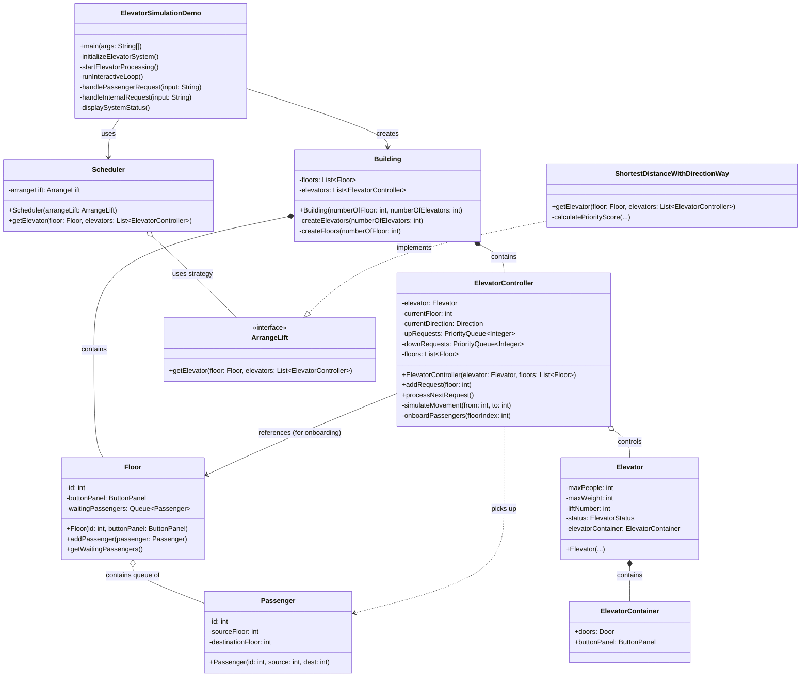

# Elevator System UML Class Diagram

## Description of Classes

*   **ElevatorSimulationDemo**: The main entry point. It initializes the building and scheduler, runs the simulation loop, and handles user input (creating passengers).
*   **Building**: Represents the physical building, containing lists of Floors and Elevators.
*   **Floor**: Represents a floor in the building. It has a queue of `waitingPassengers` who are waiting for an elevator.
*   **Passenger**: A simple data model representing a person with a Source floor and a Destination floor.
*   **ElevatorController**: The "Brain" of a specific elevator. It manages the state (current floor, direction), holds the request queues (`upRequests`, `downRequests`), moving logic, and now the `onboardPassengers` logic.
*   **Elevator**: The physical elevator attributes (capacity, weight, ID).
*   **Scheduler**: The central dispatcher. When a user requests an elevator, the Scheduler decides which ElevatorController is best suited to take the request.
*   **ArrangeLift (Interface) / ShortestDistanceWithDirectionWay**: The strategy pattern implementation for selecting the best elevator.
